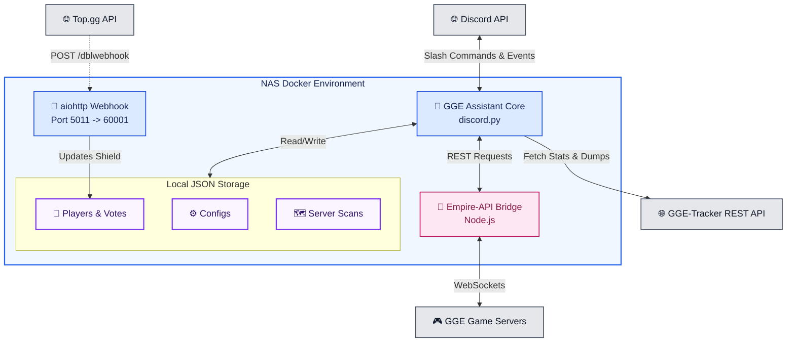

<p align="center">
    
</p>

<p align="center">
    
    
    
    
    
    
    
</p>

<p align="center">
A comprehensive Discord bot designed to assist "Goodgame Empire" (GGE) and "Empire: Four Kingdoms" (E4K) players. It provides server tracking, fortress radars, event management, and automated alerts by leveraging direct game connections and the GGE-Tracker API.
</p>

---

## 🏗️ Main Components

| Component | Stack | Role |
|---|---|---|
| **Bot Core** | `discord.py` | The main application handling commands, events, and background tasks (such as status rotation and radar scanning). |
| **Empire-API Bridge** | `Node.js` | Local REST <=> WebSocket bridge (fork of `danadum/empire-api`) holding persistent connections to the game servers. |
| **Webhook Server** | `aiohttp.web` | Listens for Top.gg upvotes on port 5011 (mapped to 60001) to automatically grant users a 7-day ad-free shield. |
| **Data Storage** | `JSON` | Local flat-file storage for player data, server configurations, and historical server scans. |
| **GGE-Tracker API** | `REST` | External backend API utilized to fetch server map dumps, player metrics, and alliance statistics. |
| **Hosting** | `Docker` | Containerized environment running Python and Node.js, optimized for 24/7 deployment. |

## 📂 Project Structure

<!-- TREE-START -->
```bash
.
├── Dockerfile
├── LICENSE
├── README.md
├── SECURITY.md
├── assets
│   └── logo.webp
├── cogs
│   ├── admin.py
│   ├── aide.py
│   ├── calendrier.py
│   ├── classement.py
│   ├── config.py
│   ├── events.py
│   ├── forteresses.py
│   ├── gge_hub_community.py
│   ├── profils.py
│   ├── radar.py
│   ├── scan_server.py
│   ├── storms.py
│   └── target.py
├── data
│   └── configs
│       ├── configuration.json
│       └── event_mapping.json
├── database
│   └── schema.sql
├── discord_bot.py
├── docker-compose.yaml
├── emojis.py
├── locales
│   ├── de.json
│   ├── en.json
│   └── fr.json
├── observability
│   ├── __init__.py
│   ├── client.py
│   ├── config.py
│   ├── context.py
│   ├── handler.py
│   ├── http_tracing.py
│   ├── recorders.py
│   └── runtime.py
├── requirements.txt
├── ruff.toml
└── utils.py

8 directories, 38 files
```
<!-- TREE-END -->
*(This section is auto-updated via GitHub Actions)*

## ⌨️ Features & Commands Reference

GGE Assistant provides a vast array of slash commands designed to track, analyze, and dominate in Goodgame Empire. Commands are categorized by their primary tactical use.

### 🛠️ Core & Utility
Essential commands to configure the bot, link accounts, and interact with the ecosystem.

| Command | Description |
|---|---|
| `/setup` | Configure your language and primary GGE server. |
| `/link_account` | Link your Discord account to your GGE username for quicker commands. |
| `/help` | Displays the complete user manual for the GGE Assistant bot. |
| `/status` | Checks the overall health status of the system (Bot, NAS, API). |
| `/news` | Read the latest bot updates and patch notes. |
| `/discover` | Discover useful tools and community projects for GGE. |
| `/vote` \| `/support` \| `/contact` | Support the bot, join the server, or message the developer. |

### 📅 Events & Community
Automated tracking for game events, alliance performance, and community news.

| Command | Description |
|---|---|
| `/calendar current` | Displays the complete, real-time calendar of events. |
| `/calendar setup` | Defines the channel where automated calendar alerts will be sent. |
| `/calendar track` / `untrack` | Manage alliances for automated end-of-event performance reports. |
| `/calendar stop` | Disable calendar alerts and event reports for the server. |
| `/hub setup` / `stop` | Configure or disable GGE Community Hub official announcements. |

### 🏆 Rankings & Leaderboards
Live parsing of the GGE-Tracker and Empire APIs for real-time competitive analysis.

| Command | Description |
|---|---|
| `/rank event` / `gacha` | Displays live rankings for standard events (Nomads, Bloodcrows, etc.) and Gachas. |
| `/rank realms` / `league` | Live rankings for cross-server events (Outer Realms, Horizon) and Kingdom Leagues. |
| `/rank statistics` / `contests` | Player statistics (Might, Plunder, Achievements) and specific contests (Nobility, Shapeshifters). |
| `/rank alliance` | Displays live rankings and statistics specifically for alliances. |
| `/leaderboard woa` | Displays the Top 100 from the latest Wheel of Affluence. |
| `/leaderboard storm_islands` | Displays the Top 100 looters of Aquamarine. |

### 👥 Intelligence (Player & Alliance)
In-depth historical and current data for specific entities on the map.

| Command | Description |
|---|---|
| `/player profile` / `history` | View a player's detailed profile and complete historical data. |
| `/player compare` | Responsive comparative analysis and calculation of the hazard index between players. |
| `/player dove` | Check the exact date and time a player's protection ended. |
| `/alliance profile` / `might` | Detailed profile of an alliance (paginated) and historical Power (PP) over time. |
| `/alliance scanner` | Analyze the enemy roster in real time (Doves, PP, Targets). |
| `/alliance property` / `description`| Displays all properties of an alliance and the history of wall changes. |
| `/event_player` / `event_alliance` | View a player's or an alliance's latest score, history, and participation in an event. |
| `/server` | Displays the global aggregated statistics of your current server. |

### ⚔️ Radars & War Tracking
The tactical core of the bot: scanning the map for targets, rivals, and free outposts.

| Command | Description |
|---|---|
| `/target setup` / `search` | Configure filters and launch the search engine to find specific targets on the map. |
| `/fortress scan` / `stop` | Manage automatic radar scanning for free fortresses (Sands, Ice, Peaks). |
| `/fortress history` | View a player's fortress attack history (up to 365 days). |
| `/radar server` / `private` | Manage the Server-wide or Personal War Radar (Live target notifications). |
| `/rival start` / `add` / `list` / `stop` | Manage a Competition Radar (up to 10 rivals) via Direct Messages. |

### ⛈️ Special Map Analyzers
Tools dedicated to temporary kingdoms and specific economy loops.

| Command | Description |
|---|---|
| `/storm forts` / `isles` | Search the Storm Islands map for available forts or resource islands. |
| `/storm occupier` | List all islands currently held by a specific player. |
| `/storm setup` / `stop` | Configure automatic pings for respawning islands in your server. |
| `/storm status` | Displays the freshness state of the Storm Islands map scan. |
| `/woa history` / `summary` | Analysis and statistics of the Wheel of Affluence (ticket consumption). |

The project follows a modular architecture. While some directories are tracked by Git, others are generated automatically at runtime:

**Tracked by Git:**
* **`.github/`**: Contains CI/CD workflows and maintenance scripts (e.g., `strip_comments.py`).
* **`empire-api/`**: Node.js REST API serving as a bridge to the game's WebSockets.
* **`cogs/`**: Contains all feature modules including `forteresses.py`, `radar.py`, `storms.py`, `events.py`, and `classement.py`.
* **`locales/`**: Internationalization files supporting French (`fr.json`), English (`en.json`), and German (`de.json`).

**Locally Generated (Ignored by Git):**
* **`data/`**: The main data store holding `joueurs/` (player tracking, votes), `server_scans/` (daily dumps for dozens of servers), and dynamically generated configuration caches (`servers_cache.json`).
* **`.env`**: Stores sensitive API keys, Webhook URLs, and Discord tokens.
* **`logs/`**: Automated daily rotating logs (`discord_bot.log`) generated by the `TimedRotatingFileHandler`.

## 🤝 Contributing

Contributions, issues, and feature requests are welcome! 
If you want to contribute to the project, please follow these steps:

1. Fork the repository
2. Create your feature branch (`git checkout -b feature/AmazingFeature`)
3. Commit your changes (`git commit -m 'Add some AmazingFeature'`)
4. Push to the branch (`git push origin feature/AmazingFeature`)
5. Open a Pull Request

## 🐛 Support & Feedback

If you encounter any bugs, have feature requests, or need help with the bot:
* Join our [Support Discord Server](https://discord.gg/zrrhxp6wDj)
* Vote for the bot on [Top.gg](https://top.gg/bot/1472309793065533493)
* Open an issue in the [Issues tab](../../issues) of this repository.

## 📄 License

This project is licensed under the Apache License 2.0 - see the [LICENSE](LICENSE) file for details.

## 🚀 Installation & Deployment

The bot is designed to run efficiently via Docker Compose.

```bash
# 1. Clone the repository
git clone https://github.com/nathael-aa/gge-assistant-bot.git && cd gge-assistant-bot

# 2. Configure environment variables
# Requires DISCORD_TOKEN, MON_ID_DISCORD, TOPGG_TOKEN, TOPGG_WEBHOOK_SECRET, WEBHOOK_SYSTEM, WEBHOOK_START, WEBHOOK_JOIN, WEBHOOK_LEAVE, WEBHOOK_VOTES, WEBHOOK_SYNC, WEBHOOK_VIGILANCE and WEBHOOK_SCAN
cp .env.example .env
nano .env

# 3. Start the bot via Docker
docker-compose up -d --build
```

## 🗺️ Architecture Diagram



## ⚖️ License and Legal Disclaimer

The source code of GGE Assistant is licensed under the **Apache License 2.0**. See the `LICENSE` file for more details.

**Third-Party Assets & Copyright:**
* **Goodgame Empire:** This is an unofficial, community-driven project. It is **not affiliated with, endorsed, sponsored, or approved by Goodgame Studios (Altigi GmbH)**. All game assets, icons, concepts, and trademarks related to Goodgame Empire are the exclusive intellectual property of Goodgame Studios.
* **Emojis:** Custom emojis found in the `assets/` folder were sourced from the community platform [emoji.gg](https://emoji.gg). They remain the property of their respective original creators and are strictly excluded from the Apache 2.0 license.
* **Artwork:** The project's visual identity, including the main banner, profile pictures, and logo (`logo.webp`), were generated using Artificial Intelligence.